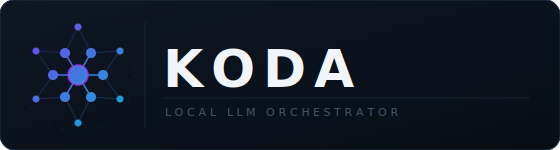

<p align="center">
  
</p>

Run AI models on your own machine. Pick a model, run one command, get a chat interface and an API — no cloud, no accounts, no data leaving your device.

Works with [OpenCode](./OPENCODE.md), [VS Code Copilot](./VSCODE.md), [Cursor](./CURSOR.md), and any OpenAI-compatible client.

<details>
<summary>Technical overview</summary>

Koda is a thin Makefile orchestration layer over [llama.cpp](https://github.com/ggml-org/llama.cpp). It manages a three-layer configuration system (`.env` defaults → `profiles/.env-<model>.<quant>` → inline overrides) and resolves model paths without triggering implicit downloads — checking `MODEL_DIR` first, then falling back to the Hugging Face cache via `find`.

`make serve` starts `llama-server`, which exposes both a built-in browser WebUI at `http://localhost:8080` and an OpenAI-compatible HTTP API at `http://localhost:8080/v1`. The `ALIAS` variable pins a stable model ID for external tool compatibility regardless of quantization swap.

Deployment paths: native `make` (full GPU via Metal/CUDA/ROCm) or Docker Compose using the official `ghcr.io/ggml-org/llama.cpp` image (GPU on NVIDIA/AMD Linux only). Traefik HTTPS is opt-in via `compose.traefik.yml`; Caddy or Tailscale cover the native path.

</details>

---

## 📖 Table of Contents
- [🚀 Quick Start](#-quick-start)
- [🛠️ Key Workflows](#️-key-workflows)
- [🐳 Docker Compose](#-docker-compose)
- [🛡️ Security & Privacy](#️-security--privacy)
- [📚 Documentation Index](#-documentation-index)
- [🏗️ Built With](#️-built-with)

---

## 🚀 Quick Start

### 1. Install Dependencies

<a name="macos-linux"></a>
**macOS / Linux**
```bash
brew install git llama.cpp huggingface-cli fzf
```

<a name="windows"></a>
**Windows**
```powershell
winget install ggml-org.llama.cpp
winget install junegunn.fzf
winget install Python.Python.3
pip install huggingface_hub[cli]
```
> `make` is required on Windows. Use [WSL](https://learn.microsoft.com/windows/wsl/), then inside WSL:
> ```bash
> sudo apt update && sudo apt install git make
> ```

<a name="docker"></a>
**Docker (no local binaries needed)**
```bash
docker compose --env-file profiles/.env-Qwen3.5-27B.Q4_K_M up -d
```
See [Docker Compose](#-docker-compose) for GPU support details.

### 2. Clone the Repository

```bash
git clone https://github.com/a1exus/koda.git && cd koda
```

### 3. Verify Environment
```bash
make check
```

### 4. Download & Serve

Pick a model profile from [profiles/README.md](./profiles/README.md), then:

```bash
make download ENV=profiles/.env-Qwen3.5-27B.Q4_K_M
make serve    ENV=profiles/.env-Qwen3.5-27B.Q4_K_M
```

Your server is now live:
- **WebUI:** `http://localhost:8080`
- **API:** `http://localhost:8080/v1` (OpenAI-compatible)

> **Smart Path Resolution:** Koda looks for the model in `MODEL_DIR` first, then falls back to the Hugging Face cache — no need to move files manually.

**Tip:** Use `make list` to see all profiles or `make select` for an interactive picker.

---

## 🛠️ Key Workflows

Every command requires an `ENV` file pointing to a model profile in `profiles/`. Koda prepends `profiles/` automatically, so `ENV=.env-gemma-4-31B-it.Q4_K_M` works.

| Command | What it does |
| :--- | :--- |
| `make serve` | Starts the **WebUI** and **OpenAI-compatible API** server |
| `make chat` | Launches an **interactive terminal session** with the model |
| `make download` | Fetches model weights from Hugging Face using `hf` |
| `make list` | Lists all available model profiles in `profiles/` |
| `make select` | Interactively select a model profile (requires `fzf` or `gum`) |
| `make cache` | Shows what models are in the local Hugging Face cache |
| `make check` | Verifies required binaries are installed and on `PATH` |
| `make check-model` | Verifies the model file for the given `ENV` is present |

### Common Overrides

Pass variables inline to any `make` target:

```bash
# Change port and restrict context window size
make serve ENV=profiles/.env-Qwen3.5-27B.Q4_K_M PORT=9090 CTX=8192

# Require an API key and expose metrics
make serve ENV=profiles/.env-Qwen3.5-27B.Q4_K_M API_KEY=my-secret METRICS=1

# Speculative decoding with a draft model
make serve ENV=profiles/.env-Qwen3.5-27B.Q4_K_M DRAFT_MODEL=./draft.gguf
```

See [AGENTS.md](./AGENTS.md) for the full list of supported variables.

---

## 🐳 Docker Compose

The Docker path requires only Docker — no `make`, no `brew`, no local binaries. The official `ghcr.io/ggml-org/llama.cpp` image is used.

```bash
docker compose --env-file profiles/.env-Qwen3.5-27B.Q4_K_M up -d
```

### GPU Support in Docker

| Platform | GPU in Docker | Notes |
| :--- | :--- | :--- |
| **NVIDIA (Linux)** | ✅ Full | Requires [NVIDIA Container Toolkit](https://docs.nvidia.com/datacenter/cloud-native/container-toolkit/install-guide.html). `compose.yaml` passes `--gpus all` automatically. |
| **AMD (Linux)** | ✅ Full | Set `LLAMA_CPP_IMAGE=ghcr.io/ggml-org/llama.cpp:server-rocm` in `.env`. |
| **Apple Silicon (macOS)** | ❌ CPU only | Docker on macOS runs in a Linux VM — Metal/GPU is not accessible. |
| **Windows** | ❌ CPU only | Same VM limitation. NVIDIA passthrough is possible via WSL2 but not officially supported here. |

> **Apple Silicon and Windows users:** use the native `make` path (Options A / B above) to get GPU acceleration. Docker is fine for CPU-only use or quick testing.

See [GEMINI.md](./GEMINI.md) for full Docker usage and configuration details.

---

## 🛡️ Security & Privacy

Koda is **local-first** — your data never leaves your machine.

- **Privacy:** No telemetry, no tracking, no cloud dependencies.
- **Integrity:** Automated vulnerability and misconfiguration scanning via [Trivy](https://github.com/aquasecurity/trivy) and GitHub Actions.

---

## 📚 Documentation Index

| File | Purpose |
| :--- | :--- |
| [**profiles/README.md**](./profiles/README.md) | Catalog of bundled models, download links, and hardware requirements |
| [**AGENTS.md**](./AGENTS.md) | Technical reference for developers and AI agents — all variables, targets, and behaviors |
| [**GEMINI.md**](./GEMINI.md) | Full Docker Compose usage, volume sharing, GPU config, and override reference |
| [**OPENCODE.md**](./OPENCODE.md) | Integration guide for [OpenCode](https://opencode.ai) |
| [**VSCODE.md**](./VSCODE.md) | Integration guide for VS Code (Copilot BYOM, Continue, Roo) |
| [**CURSOR.md**](./CURSOR.md) | Integration guide for Cursor (requires HTTPS — Traefik, Caddy, or Tailscale) |
| [**CADDY.md**](./CADDY.md) | HTTPS termination for native `make serve` (Apple Silicon, Windows) |
| [**TAILSCALE.md**](./TAILSCALE.md) | Private remote access and multi-machine RPC pooling |

---

## 🏗️ Built With

Koda is a thin layer standing on the shoulders of giants:

| Project | Role |
| :--- | :--- |
| **[llama.cpp](https://github.com/ggml-org/llama.cpp)** | Inference engine — provides `llama-server` (API + WebUI) and `llama-cli` (terminal chat) |
| **[huggingface-cli](https://huggingface.co/docs/huggingface_hub/guides/cli)** | Model downloader — `make download` uses `hf` to fetch GGUF files from HuggingFace |
| **[fzf](https://github.com/junegunn/fzf)** | Interactive profile picker — primary backend for `make select` |
| **[gum](https://github.com/charmbracelet/gum)** | Interactive profile picker — alternative backend for `make select` if fzf is not installed |
| **[Docker Compose](https://docs.docker.com/compose/)** | Containerized deployment path — no local binaries required |
| **[Traefik](https://traefik.io/)** | Reverse proxy — provides HTTPS termination in the Docker Compose path |
| **[Caddy](https://github.com/caddyserver/caddy)** | HTTPS termination for the native `make serve` path — required for Cursor on Apple Silicon and Windows where Docker GPU is unavailable |
| **[Tailscale](https://tailscale.com/)** | Private network — secure remote access and multi-machine RPC pooling |
| **[Trivy](https://github.com/aquasecurity/trivy)** | Security scanning — automated vulnerability checks via GitHub Actions |

---

**Curated by [DimkaNYC](https://huggingface.co/DimkaNYC)** | **[Instagram](https://www.instagram.com/p/DWPRNjmj6R9/)**
*Koda tooling is released under the [Apache 2.0 License](./LICENSE). Model weights belong to their respective creators.*
