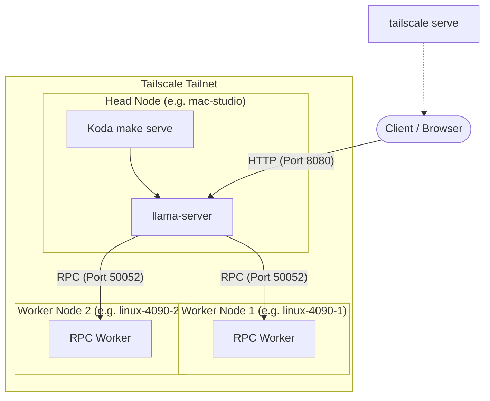

# Tailscale + Koda (via llama.cpp)

This guide covers the practical Koda setup for:

- reaching a Koda server privately over your Tailscale tailnet
- using `RPC=` to pool multiple machines together for `llama.cpp` distributed inference

Koda does not manage Tailscale itself. It only provides the `RPC=` passthrough to `llama-server` and `llama-cli`.

## What This Is Good For

Use Tailscale when you want:

- one Koda node to act as the main `llama-server`
- one or more helper machines to contribute compute over `llama.cpp` RPC
- private access across machines without exposing the server to the public internet

Tailscale is a good fit here because it gives each machine a stable tailnet IP or MagicDNS name and encrypts the traffic between them.

Sources:
- [Tailscale Serve docs](https://tailscale.com/docs/features/tailscale-serve)
- [Tailscale reserved IP docs](https://tailscale.com/docs/reference/reserved-ip-addresses)
- [llama.cpp supported backends](https://github.com/ggml-org/llama.cpp)

## Topology

The usual layout is:

1. A head node runs `make serve`.
2. One or more worker nodes run the `llama.cpp` RPC worker/server process.
3. The head node uses `RPC=...` to point `llama-server` at those workers.
4. Clients talk only to the head node.



Example:

- head node: `mac-studio`
- worker node 1: `linux-4090-1`
- worker node 2: `linux-4090-2`

The head node serves the WebUI and OAI-compatible API. The workers only provide backend compute.

## Prerequisites

This guide assumes you have already [installed Tailscale](https://tailscale.com/download) and joined all machines to the same tailnet.

Verify connectivity between nodes before proceeding:

```bash
tailscale status
tailscale ping <hostname>
```

Prefer MagicDNS hostnames for stable addressing.

## Private Tailnet Access to Koda

If you only want private access inside your tailnet, the simplest path is:

```bash
make serve ENV=profiles/.env-gpt-oss-20b.MXFP4 HOST=127.0.0.1
tailscale serve 8080
```

That gives you a private tailnet URL to the Koda WebUI and API without exposing it publicly.

Why this shape:

- Koda stays bound to localhost on the host machine
- Tailscale Serve publishes it only to your tailnet
- you avoid binding `llama-server` directly to your LAN

If you do not want to use `tailscale serve`, you can instead bind directly to the Tailscale interface or to `0.0.0.0` and rely on local firewall rules, but `tailscale serve` is the cleaner default.

Source:
- [Tailscale Serve docs](https://tailscale.com/docs/features/tailscale-serve)

## Pooling Many Machines with RPC

Koda exposes `llama.cpp` RPC via the `RPC=` variable:

```bash
make serve ENV=profiles/.env-gpt-oss-120b.MXFP4 RPC=linux-4090-1:50052
```

or:

```bash
make chat ENV=profiles/.env-gpt-oss-120b.MXFP4 RPC=linux-4090-1:50052
```

For multiple workers, pass the exact `--rpc` value that your installed `llama.cpp` build expects.

Example shape:

```bash
make serve ENV=profiles/.env-gpt-oss-120b.MXFP4 RPC=linux-4090-1:50052,linux-4090-2:50052
```

Important caveat:

- Koda passes `RPC=` straight through to `llama.cpp` as `--rpc ...`
- the accepted format for multiple workers is defined by your installed `llama.cpp` build, not by Koda

That is intentional. Koda stays thin here and does not try to invent its own RPC syntax.

Sources:
- [llama.cpp repo](https://github.com/ggml-org/llama.cpp)
- [Distributed inference discussion](https://github.com/ggml-org/llama.cpp/discussions/15796)

## Worker Nodes

Each worker machine must:

- be on the same Tailscale tailnet
- have a `llama.cpp` build with RPC backend support
- run the `llama.cpp` RPC worker/server process on a reachable port

The exact worker binary name and flags can vary across `llama.cpp` versions and build setups, so check your installed build for the current RPC worker command.

What Koda assumes:

- your workers are already up
- the head node can reach them over Tailscale
- you know the hostnames/IPs and ports to place in `RPC=...`

If you are building `llama.cpp` yourself for worker machines, confirm that the RPC backend is enabled in your build.

Sources:
- [llama.cpp supported backends](https://github.com/ggml-org/llama.cpp)
- [RPC over Ethernet discussion](https://github.com/ggml-org/llama.cpp/discussions/9136)

## Practical Recommendations

- Keep one head node and add workers only when the model no longer fits comfortably on a single machine.
- Prefer wired Ethernet on the worker machines even if Tailscale is the overlay; RPC traffic still depends on the underlying network.
- Use MagicDNS names instead of raw IPs when possible, so replacing a worker is less painful.
- Start with one worker, verify throughput and stability, then add more.
- Use `METRICS=1` on the head node if you want observability from `llama-server`.

Example:

```bash
make serve ENV=profiles/.env-gpt-oss-120b.MXFP4 \
  RPC=linux-4090-1:50052,linux-4090-2:50052 \
  METRICS=1
```

## Tailnet-Only Exposure vs Public Exposure

For Koda, prefer:

- `tailscale serve` for private tailnet access

Avoid by default:

- `tailscale funnel` for public internet exposure

`tailscale funnel` is for public sharing. That is usually the wrong default for a local `llama-server`, especially if it has no rate limiting or auth layer in front of it.

Source:
- [Tailscale Funnel docs](https://tailscale.com/docs/features/tailscale-funnel)

## Suggested Operating Model

If you want the cleanest long-term setup:

1. Install Tailscale on every machine.
2. Put all compute nodes in the same tailnet.
3. Run the RPC worker on each helper machine.
4. Run Koda on one head node.
5. Use `RPC=` on the head node to target the workers.
6. Use `tailscale serve 8080` on the head node for private access to the WebUI and API.

That gives you:

- private remote access
- a single stable API endpoint
- a clean place to add or replace helper machines

## Limits

Tailscale does not change `llama.cpp`'s RPC behavior; it only gives you secure reachability.

So performance still depends on:

- worker hardware
- underlying network speed and latency
- model size and sharding behavior
- how your specific `llama.cpp` build handles RPC distribution

If a model already fits well on one machine, distributed RPC may be slower than running locally on that machine due to network overhead.
